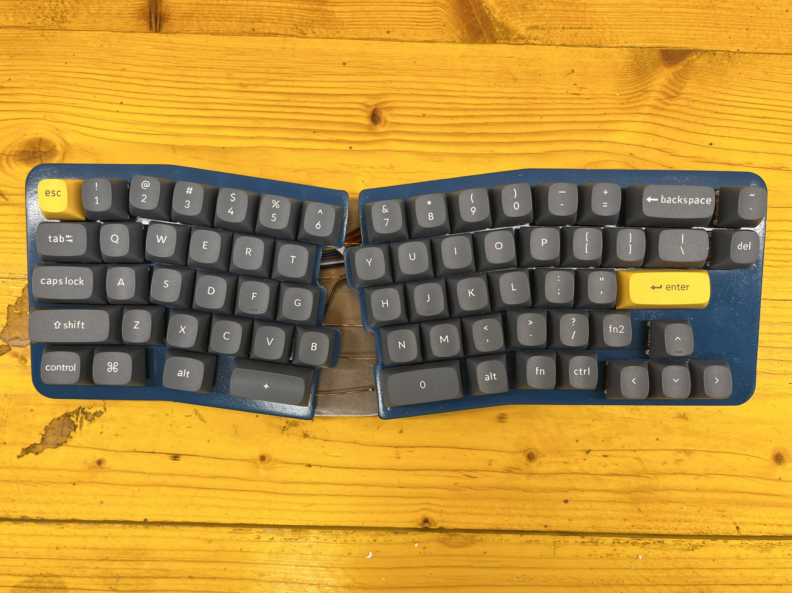
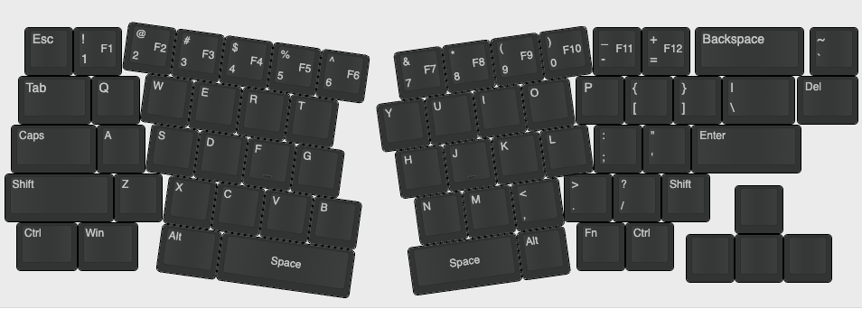
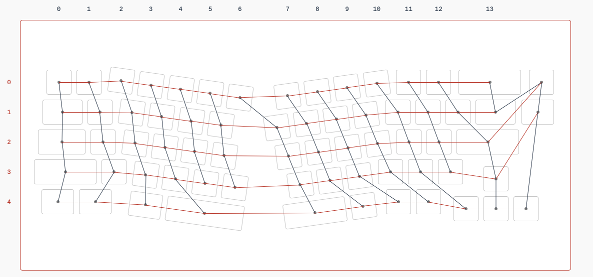
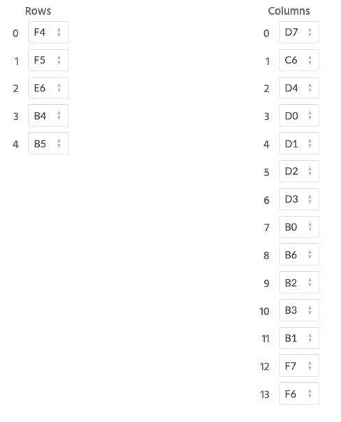
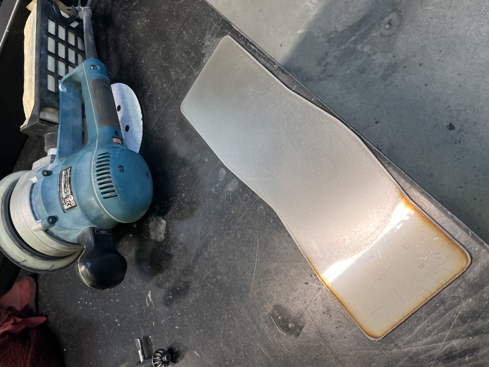
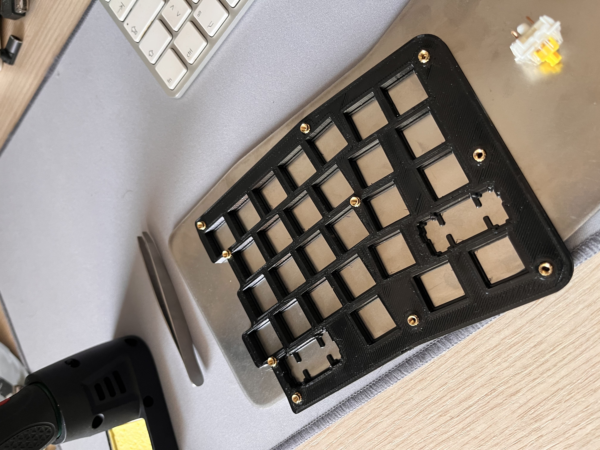
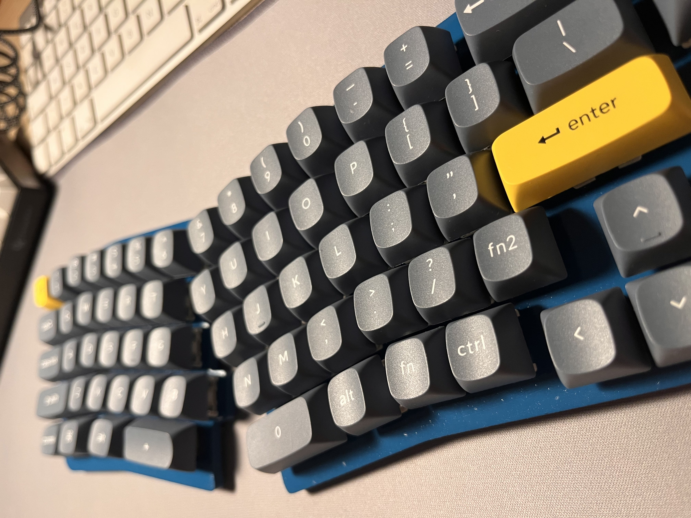
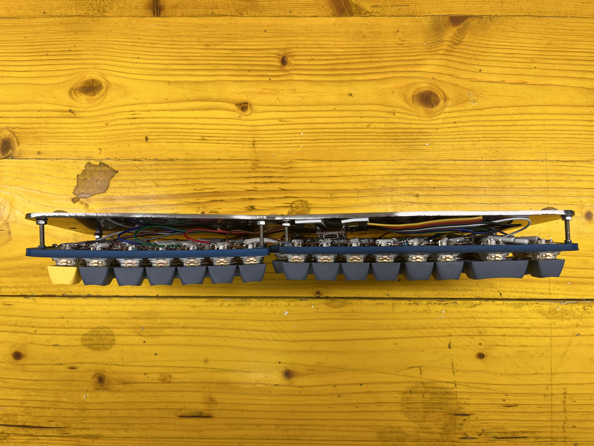
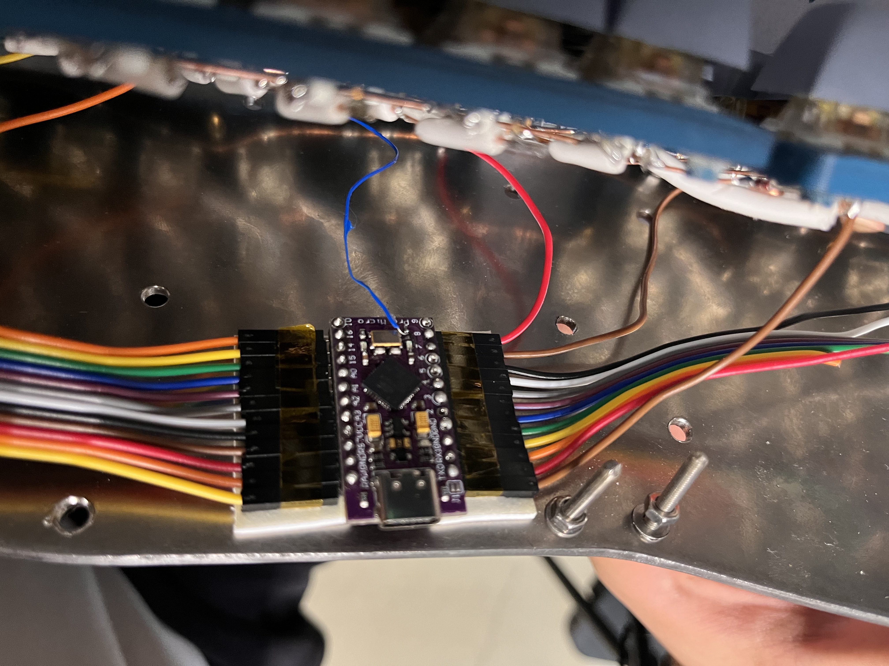
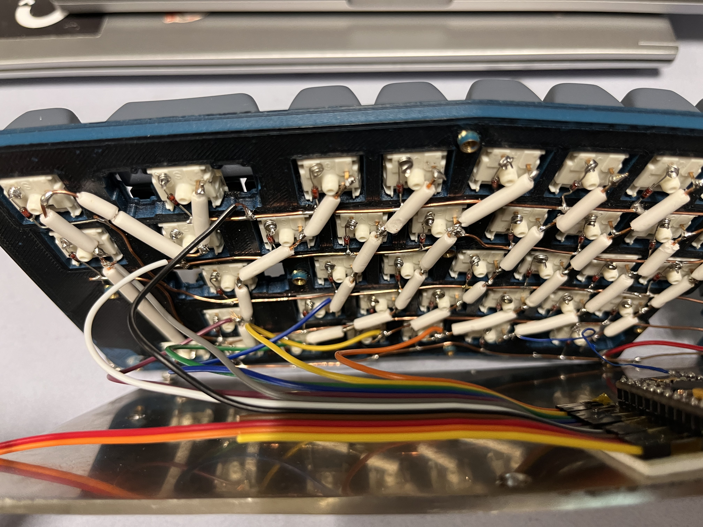

# ST-Keeb-67

## Handwired Keyboard



This handwired keyboard has a unique design with a plasma cutted inox frame and a 3d printed split plate, it reflects the perfect combination of both the aesthetics and functionality. The keyboard has a sleek, modern design with a plasma cutted inox base that is both durable and aesthetically pleasing. The frame is sanded in order to have glossy finish, which provides a unique look.

The 3d printed split plate is designed to ensure that each switch is positioned correctly and to prevent any rattling of the switches during typing. The plate is made with high-quality PETG and is designed to last. The brass inserts used in the 3d printed parts ensure that the screws are held securely in place.

## Microcontroller

The keyboard is powered by an Arduino pro micro microcontroller, which is connected to each switch on the board using a matrix scheme.

## Switches

The switches used in this keyboard are Gateron yellow pro switches. These switches have a smooth linear feel that makes them perfect for typing. They also have a high actuation force, which ensures that accidental keypresses are rare.

## BOM

- 1x Plasma cutted inox frame (also 3d printable)

- 1x 3d printed split plate

- 1x Arduino pro micro (or ATMega 32u4 compatible microcontroller)

- 67x Gateron yellow pro switch

- 67x 1N4148 diod

- 8x M3 screw

- 8x M3x4mm brass insert

## Layout and Matrix scheme



The matrix configuration is peculiar but functional. This has been done to facilitate assembly operations.
<a href="https://golem.hu/guide/pro-micro-upgrade/"> 
 Must follow this guide in order to use the led pin as input for the matrix.
</a>



## Photos

| Orbital Sanding | Printed Part | Final Without Base |
| :----------------------------: | :-------------------------------------: | :------------------------------------------------------------------------: |
|  |  | |


| Back | Microcontroller | Matrix |
| :----------------------------: | :-------------------------------------: | :------------------------------------------------------------------------: |
|  |  | |


| Final | 
| :----------------------------: |
|  |
## Repo structure

```text
ST_KEEB
    ├── 3d Files
    │   ├── plateLeft.stl
    │   ├── plateRight.stl
    │   ├── st-keeb-base.dxf
    │   ├── st-keeb-base.pdf
    │   ├── st-keeb-base.stl
    │   └── st-keeb-baseWithHoles.stl
    ├── README.md
    ├── images
    │   ├── ...
    ├── st-keeb-kle.json -> keyboard layout editor config
    ├── st-keeb.hex -> precompiled firmware for ATMega32u4
    ├── st-keeb.json -> kbfirmware config
    └── st-keeb.zip -> kbfirmware config
```

## Conclusion

If you're looking for a high-quality, handwired keyboard that is both aesthetically pleasing and functional, this keyboard is an excellent option. With its unique design, high-quality materials, and excellent switches, it provides a fantastic typing experience. Plus, the 3d printed parts make it customizable and easy to assemble.
